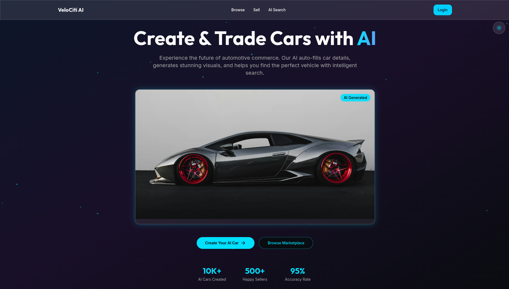
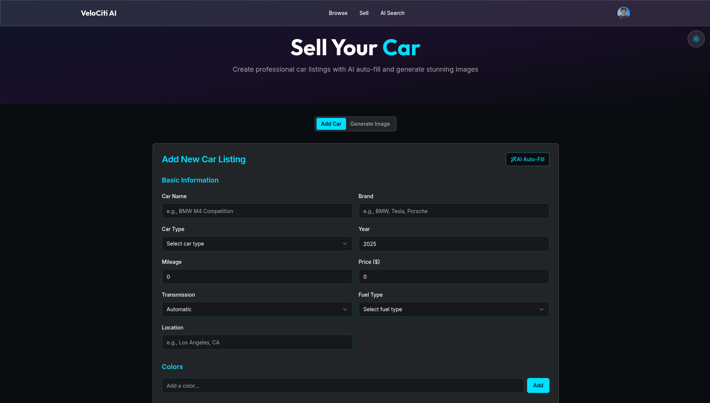
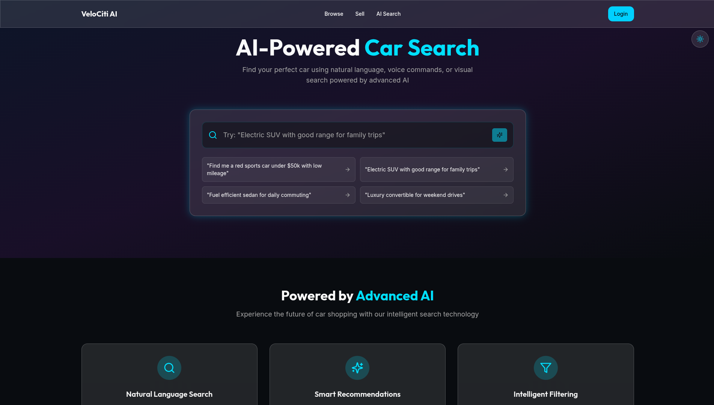
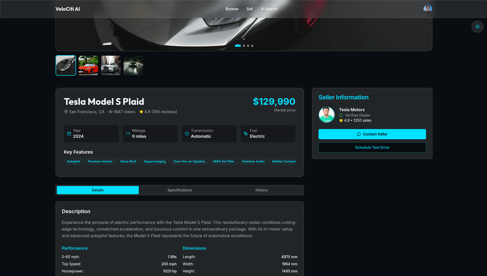

# VeloCiti AI 🚗⚡


An **AI-powered car marketplace** that simplifies car listing and enhances discovery with intelligent features.

## ✨ Features

- 🤖 **AI Autofill**: Reduces manual input by ~70% using Gemini AI
- 🔍 **Smart Search**: AI-powered recommendations improve engagement by ~30%
- 🖼️ **AI Car Images**: Generate realistic car visuals with ImageKit
- ⚡ **Modern UI**: Fast, responsive design with Next.js and Tailwind

## 🛠️ Tech Stack

- **Frontend**: Next.js, TypeScript, Tailwind CSS
- **AI**: Gemini AI
- **Images**: ImageKit API
- **Deploy**: Vercel

## 🚀 Quick Start

```bash
# Clone repository
git clone https://github.com/swastikpratik-bit/VeloCiti-AI.git
cd VeloCiti-AI

# Install dependencies
npm install

# Set environment variables
cp .env.example .env.local
# Add your API keys for Gemini AI and ImageKit

# Run development server
npm run dev
```

## 📁 Project Structure

```
src/
├── app/           # Next.js app router
├── components/    # Reusable UI components
├── lib/          # Utilities and API clients
└── types/        # TypeScript definitions
```

## 🔧 Environment Variables

```env
GEMINI_API_KEY=your_gemini_api_key
IMAGEKIT_PUBLIC_KEY=your_imagekit_public_key
IMAGEKIT_PRIVATE_KEY=your_imagekit_private_key
IMAGEKIT_URL_ENDPOINT=your_imagekit_url
```

## 📸 Screenshots

| Home Page | AI Autofill |
|-----------|-------------|
|  |  |

| Smart Search | Car Details |
|--------------|-------------|
|  |  |